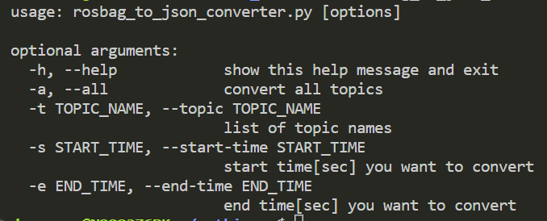
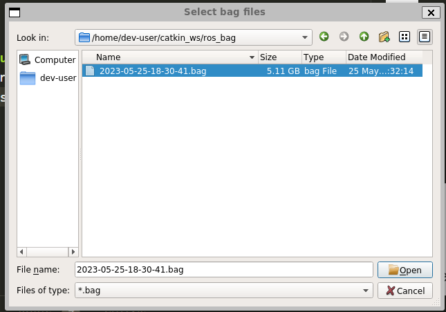
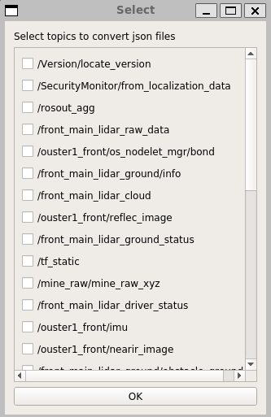
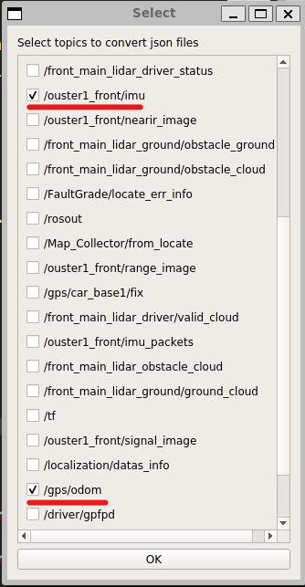

# rosbag_to_json_converter
GUI tool to convert topics in rosbag file to json file.  

## Supported versions
Currently, this tool supports Python2 and behavior was confirmed on ROS Melodic.

## How to use
### 1. Installation
Clone this repository in your ROS workspace and execute the following commands.  If you have not initialized rosdep yet, please run rosdep init and update commends before installation.  
```bash
$ cd ~/catkin_ws/src
$ git clone https://github.com/ShisatoYano/rosbag_to_json_converter.git
$ cd ~/catkin_ws
$ rosdep install -r --ignore-src --from-paths src
$ catkin_make
```

### 2. Start this tool's ROS node
Execute this command.  
```bash
$ rosrun rosbag_to_json_converter rosbag_to_json_converter.py
```

By executing the command with an option, -h or --help, you can see optional arguments as follow.  
  

### 3. Select bag file from dialogue
After you executed the above command, an dialogue to select a rosbag file will be displayed as follow. And then, select bag file and click "Open" button.  
  

### 4. Select topics to convert
After you selected bag files, an GUI to select topics you want to convert will be displayed as follow.  
  

You can selsect single or multiple topics. After that, please push "OK" button.  
  

